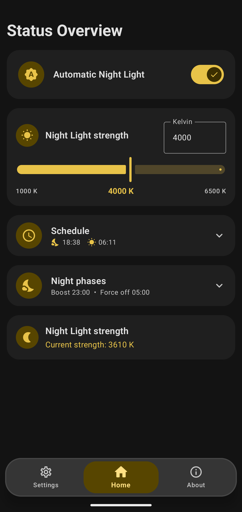
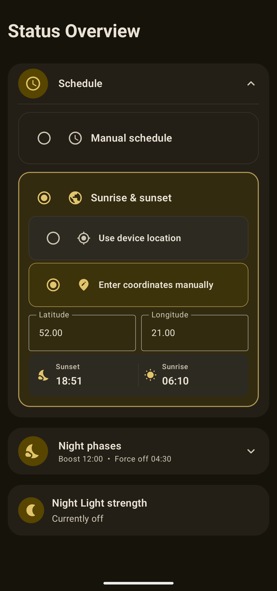
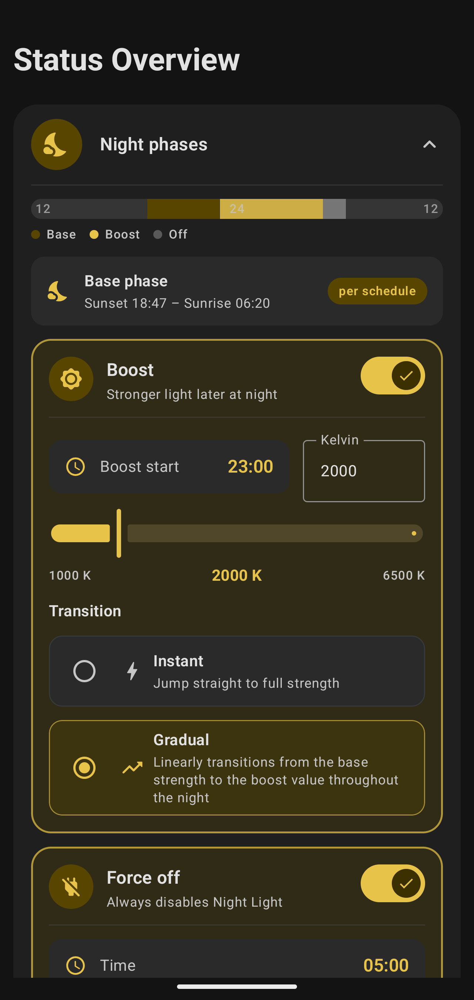

# Better Night Light

## Requirements

- **Android 10 (API 29) or higher**
- One of the following options to grant the app the permissions required to control Night Light:
  - **ADB**
  - **Shizuku** (or compatible alternatives)
  - **Root** access

> [!WARNING]
> This app has only been tested on emulators and a Pixel 10 Pro. Use it at your own risk.

## Screenshots

&nbsp;&nbsp;&nbsp;
&nbsp;&nbsp;&nbsp;

## Features

- **Flexible scheduling** - manual start/end times or automatic sunrise & sunset based on your location (auto-detected or entered manually).
- **Night phases** - go beyond a simple on/off schedule:
  - **Base** phase covering the main part of the night,
  - **Boost** phase with a stronger filter later at night,
  - **Force off** phase after which the filter stays off.
- **Adjustable strength** - set the color temperature anywhere from 1000 K to 6500 K, for each phase separately.
- **Smooth transitions** - apply changes instantly or ramp gradually across the night.
- **Reliable automation** - a foreground service keeps the schedule up to date, backed by periodic work as a safety net. Everything restarts automatically after a reboot.

## Why?

Not all ROMs expose advanced Night Light scheduling, and the built-in options are often limited to a simple sunset-to-sunrise toggle. Better Night Light fills that gap by controlling the system's native Night Light directly.

Why use the native Night Light instead of overlay apps?

- **True color transformation.** Native Night Light adjusts each pixel's R, G, and B values directly in the GPU rendering pipeline, *before* the image is displayed. Overlay apps simply draw a semi-transparent layer on top of the already-rendered image, which washes out contrast and mutes saturation.
- **Zero performance cost.** The system-level approach adds no extra GPU or battery load, whereas an overlay layer must be rendered every single frame.
- **Complete coverage.** Night Light applies its transform at the final display pipeline stage, so it uniformly covers every visible pixel - including privileged system UI like the notification shade and lock screen, above which overlay apps cannot render.

## License

Licensed under the [GNU GPL v3](LICENSE) or any later version.
